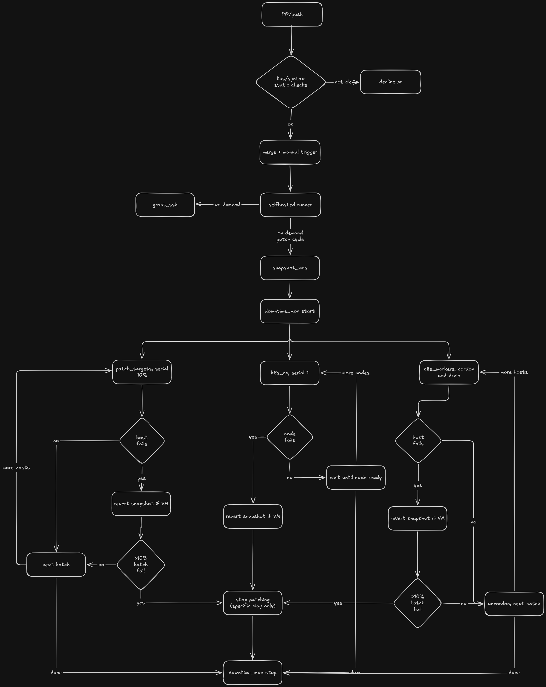

# Patch Cycle

Ansible‑based patching of RHEL servers (VMs + bare metal) and Kubernetes nodes, orchestrated via GitHub Actions.

## Architecture

- **Snapshot** VMs before patching.
- **Open monitoring downtime** before starting.
- **Patch** in batches with independent failure domains:
  - Generic servers – serial batches, 10% tolerance.
  - Kubernetes control plane – serial `1`, zero tolerance.
  - Kubernetes workers – serial batches, 10% tolerance.
- **Per‑host revert** – failed VMs are automatically restored from snapshot.
- **Monitoring downtime** is **always** closed – `if: always()` in CI guarantees it.

## Usage

Trigger the `patch_cycle.yml` workflow manually.  
Set `dry_run` to `true` to test snapshot/downtime flow without actually patching.

## Files

- `.github/workflows/patch_cycle.yml` – main orchestration.
- `.github/workflows/lint.yml` – static checks.
- `.github/workflows/run_grant_ssh.yml` – ad‑hoc SSH access.
- `playbooks/grant_ssh.yml` – add SSH key.
- `playbooks/snapshot_vms.yml` – VM snapshots.
- `playbooks/downtime_mon.yml` – monitoring downtime.
- `playbooks/patch.yml` – core patching logic (three independent plays).
- `inventory.yml` – host groups and IPs.
- `group_vars/all.yml` – non‑secret configuration.
- `group_vars/vault.yml` – encrypted secrets (use the `.example` template).